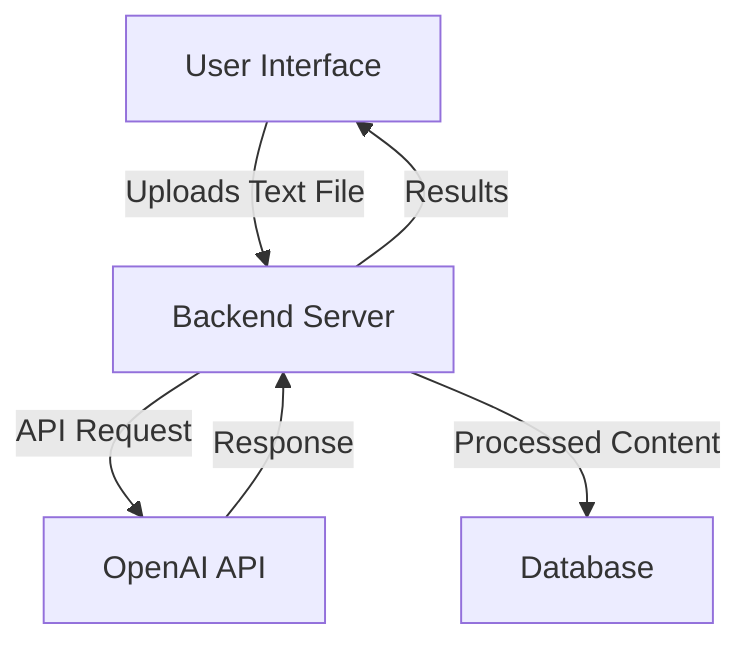

# Web Application for Text Analysis and Heading Generation

## Project Overview
This web application will allow users to upload text files, analyze the content using the OpenAI API, and automatically generate hierarchical headings (level 1 through 5) based on the text structure and content.

## System Architecture

## Development Phases

### Phase 1: Project Setup and Basic UI
1. Set up the project structure with necessary folders
2. Initialize a Node.js project with Express for the backend
3. Create a basic HTML/CSS frontend with a file upload form
4. Set up environment variables for API keys and configuration

### Phase 2: Backend Development
1. Implement file upload handling with proper validation
2. Set up authentication for the OpenAI API
3. Create endpoints for:
   - File upload
   - Text analysis request
   - Results retrieval
4. Implement error handling and logging

### Phase 3: OpenAI Integration
1. Develop functions to process text for OpenAI API
2. Create API calls to OpenAI for text analysis
3. Implement response parsing to extract heading structure
4. Add retry logic for API calls with rate limiting

### Phase 4: Frontend Development
1. Create a responsive UI for file upload
2. Implement a loading indicator for API calls
3. Design a display for the analyzed text with headings
4. Add user feedback mechanisms for success/error states

### Phase 5: Testing and Deployment
1. Write unit and integration tests
2. Perform user acceptance testing
3. Optimize performance
4. Prepare for deployment

## Technology Stack

### Frontend
- HTML5
- CSS3 (with Flexbox/Grid for responsive design)
- JavaScript (ES6+)
- Bootstrap (for UI components)

### Backend
- Node.js
- Express.js
- Multer (for file uploads)
- Axios (for API calls)

### API Integration
- OpenAI API (GPT-3.5 or GPT-4)

### Database (Optional)
- MongoDB or PostgreSQL for storing processed results

## Implementation Details

### File Upload Component
- Create a drag-and-drop area for file uploads
- Implement file type validation (only text files)
- Add progress indicators for large file uploads

### Text Analysis Process
1. Receive uploaded text file
2. Extract text content
3. Send text to OpenAI API with specific instructions for heading generation
4. Process API response to extract heading structure
5. Format the text with appropriate HTML heading tags

### OpenAI API Integration
- Use the GPT-3.5 or GPT-4 model
- Create a prompt that instructs the model to identify and create headings
- Handle API response parsing to extract heading information
- Implement error handling for API failures

### Results Display
- Create a clean, readable interface for displaying the analyzed text
- Use different colors or styles for different heading levels
- Implement a toggle for showing/hiding the original text
- Add a download button for saving the processed text

## Security Considerations
- Implement proper authentication for API calls
- Store API keys securely using environment variables
- Validate all user inputs to prevent injection attacks
- Implement proper file handling to prevent security vulnerabilities

## Performance Considerations
- Implement caching for processed results
- Optimize API calls to minimize response time
- Implement client-side validation before file upload
- Consider implementing a queue system for multiple concurrent requests

## Future Enhancements
- Add support for multiple file formats (PDF, DOCX)
- Implement user accounts for saving processed results
- Add more text analysis features (sentiment analysis, keyword extraction)
- Implement a dark mode for the UI
- Add support for collaborative editing